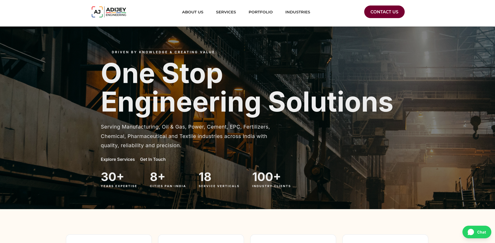

# ADIJEY Engineering Solutions — Official Website

> **"Driven by Knowledge & Creating Value"**  
> Corporate website for AdiJey Engineering Solutions (OPC) Private Limited — a one-stop engineering solutions provider serving Manufacturing, Oil & Gas, Power, Cement, EPC, and Process industries across India.

---

## 🔗 Hosted Link

> _[AdiJey Engineering Solutions](https://adijey.com)_

---

## 📸 Preview

> 


---

## 🧭 Project Overview

This is the official corporate website for **AdiJey Engineering Solutions (OPC) Pvt. Ltd.**, built as a freelance/contract project. The site serves as the company's primary digital presence — showcasing their engineering product portfolio, service capabilities, and enabling direct client enquiries.

**Key goals:**
- Establish a professional online presence aligned with the ADIJEY brand (navy/red palette, Bebas Neue + Inter typography)
- Surface the company's broad product & service portfolio to industrial buyers
- Convert visitors into leads via a structured contact/enquiry flow
- Provide the company admin team with a secure dashboard to manage inbound enquiries

---

## ⚙️ Tech Stack

| Layer | Technology |
|---|---|
| Framework | [Next.js 14](https://nextjs.org/) (App Router) |
| Styling | Tailwind CSS |
| Typography | Bebas Neue (display) · Inter (body) |
| Backend / DB | [Supabase](https://supabase.com/) (PostgreSQL + Row Level Security) |
| Auth | Supabase Auth (admin dashboard protection) |
| Deployment | Vercel |
| Language | TypeScript |

---

## ✨ Features

### Public-Facing
- **Hero section** — Brand-first landing with company tagline and CTA
- **About** — Founder background, mission statement, company ethos
- **Products & Services** — Full portfolio across 18 categories (PPE, Electrical, C&I, Chemicals, Fabrication, Fans & Blowers, FGD, Valves, and more)
- **Industries Served** — Visual breakdown of target sectors (Power, Oil & Gas, Cement, Pharma, etc.)
- **Clients** — Logos/names of key clients (Bharat Petroleum, Samsung, Air Products, Cairn, NTPC, etc.)
- **Contact / Enquiry Form** — Supabase-backed form with **client-side rate limiting** to prevent spam
- **Responsive Design** — Mobile-first, works across all screen sizes

### Admin Dashboard (`/admin`)
- **Protected route** — Supabase Auth session required; brute-force protection on login
- **Enquiry viewer** — Table of all inbound contact submissions from the public form
- **Read/unread state** — Mark enquiries as reviewed
- Designed for non-technical internal users

---

## 🗂️ Project Structure

```
adijey/
├── app/
│   ├── (public)/
│   │   ├── page.tsx              # Homepage
│   │   ├── about/page.tsx
│   │   ├── services/page.tsx
│   │   ├── contact/page.tsx
│   │   └── layout.tsx
│   ├── admin/
│   │   ├── page.tsx              # Enquiry dashboard
│   │   └── login/page.tsx
│   └── api/
│       └── contact/route.ts      # Form submission handler
├── components/
│   ├── ui/                       # Reusable primitives
│   ├── Navbar.tsx
│   ├── Footer.tsx
│   ├── HeroSection.tsx
│   ├── ServicesGrid.tsx
│   ├── ContactForm.tsx
│   └── AdminEnquiryTable.tsx
├── lib/
│   ├── supabase/
│   │   ├── client.ts             # Browser Supabase client
│   │   └── server.ts             # Server-side Supabase client
│   └── rateLimit.ts              # Client-side rate limiting logic
├── public/
│   └── assets/                   # Logo, brand images
├── styles/
│   └── globals.css
├── .env.local                    # 🔒 Not committed — see Environment Variables
├── next.config.ts
├── tailwind.config.ts
└── tsconfig.json
```

---

## 🗄️ Database Schema (Supabase)

### `enquiries` table

| Column | Type | Notes |
|---|---|---|
| `id` | `uuid` | Primary key, auto-generated |
| `created_at` | `timestamptz` | Auto-set on insert |
| `name` | `text` | Submitter's full name |
| `email` | `text` | Contact email |
| `phone` | `text` | Contact number (optional) |
| `company` | `text` | Company / organisation name |
| `message` | `text` | Enquiry body |
| `is_read` | `boolean` | Default `false`; toggled in admin dashboard |

### Row Level Security (RLS) Policies

```sql
-- Public: INSERT only (no reading your own or others' enquiries)
CREATE POLICY "Allow public inserts"
  ON enquiries FOR INSERT
  TO anon
  WITH CHECK (true);

-- Admin: Full access (authenticated users only)
CREATE POLICY "Admin full access"
  ON enquiries FOR ALL
  TO authenticated
  USING (true);
```

> RLS is **enabled** on the `enquiries` table. Anonymous users can only insert; reads are restricted to authenticated sessions (admin).

---

## 🔐 Environment Variables

Create a `.env.local` file in the project root:

```env
# Supabase
NEXT_PUBLIC_SUPABASE_URL=https://your-project.supabase.co
NEXT_PUBLIC_SUPABASE_ANON_KEY=your-anon-key
SUPABASE_SERVICE_ROLE_KEY=your-service-role-key   # Server-side only, never expose

# Admin auth (if using custom credentials layer)
ADMIN_EMAIL=admin@adijey.com
```

> ⚠️ **Never commit `.env.local` to version control.** The `.gitignore` already excludes it.

---

## 🚀 Getting Started

### Prerequisites
- Node.js ≥ 18
- npm / yarn / pnpm
- A [Supabase](https://supabase.com/) project (free tier works)

### Installation

```bash
# 1. Clone the repo
git clone https://github.com/radon19/adijey.git
cd adijey

# 2. Install dependencies
npm install

# 3. Set up environment variables
cp .env.example .env.local
# → Fill in your Supabase URL and keys

# 4. Run the development server
npm run dev
```

Open [http://localhost:3000](http://localhost:3000) in your browser.

### Supabase Setup

1. Create a new Supabase project at [supabase.com](https://supabase.com)
2. Run the SQL in `supabase/schema.sql` via the Supabase SQL editor to create the `enquiries` table and RLS policies
3. Add your project's `URL` and `anon key` to `.env.local`
4. Enable **Email Auth** in Supabase → Authentication → Providers, and create an admin user

---

## 🧪 Scripts

```bash
npm run dev        # Start development server (localhost:3000)
npm run build      # Production build
npm run start      # Start production server
npm run lint       # ESLint check
npm run type-check # TypeScript type check (tsc --noEmit)
```

---

## 🎨 Brand & Design System

| Token | Value |
|---|---|
| Primary (Navy) | `#0A1628` |
| Accent (Red) | `#CC1C24` |
| Surface | `#FFFFFF` |
| Muted | `#F4F6F9` |
| Display font | Bebas Neue |
| Body font | Inter |

The visual identity follows the four-color corner-bracket logo system with the "AJ" monogram, maintaining strict navy/red/white throughout all UI components.

---

## 📦 Deployment (Vercel)

The project is deployed on [Vercel](https://vercel.com/) with zero-config Next.js support.

```bash
# Install Vercel CLI (optional)
npm i -g vercel

# Deploy
vercel
```

**Required environment variables in Vercel dashboard:**
- `NEXT_PUBLIC_SUPABASE_URL`
- `NEXT_PUBLIC_SUPABASE_ANON_KEY`
- `SUPABASE_SERVICE_ROLE_KEY`

---

## 🏢 About the Company

**AdiJey Engineering Solutions (OPC) Pvt. Ltd.** is a one-stop engineering solutions provider founded by a BITS Pilani graduate engineer with 30+ years of industry experience. The company serves major sectors including Power, Oil & Gas, Cement, EPC, Fertilizers, Pharmaceuticals, and more.

**Clients include:** Bharat Petroleum · Air Products · Samsung · Cairn · NTPC · BHEL · NPCIL

**Offices:** Raipur · New Delhi · Nagpur · Hyderabad · Mangalore · Bangalore · Buxar

**Contact:** +91 81693 84266 · info@adijey.com · [adijey.com](https://adijey.com)

---

## 👤 Developer

**Kedar** — Web Developer  
GitHub: [@radon19](https://github.com/radon19)

> Built as a freelance project. For enquiries about similar work, reach out via GitHub.

---

## 📄 License

This codebase is proprietary. All rights reserved by AdiJey Engineering Solutions (OPC) Pvt. Ltd.  
Unauthorised copying, distribution, or use is strictly prohibited.

---

<p align="center">
  Built with Next.js · Supabase · Tailwind CSS · Deployed on Vercel
</p>